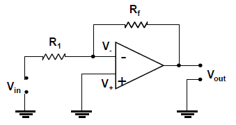
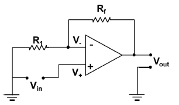
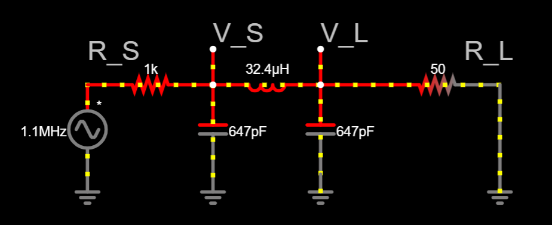

something something i'm not responsible for lost marks. have fun.

# Constants

| Name              | Symbol  | Value                   |
| ----------------- | ------- | ----------------------- |
| Speed of light    | $c$     | $3\times 10^8$          |
| Elementary charge | $q_e$   | $1.6022\times 10^{-19}$ |
| Magnetic constant | $\mu_0$ | $4\pi \times 10^{-7}$   |

# Basic math

$$
\begin{align}
    x &= \frac{-b\pm\sqrt{b^2-4ac}}{2a}\\
    \sin(\theta) &= \cos(\theta-90°)\\
    \cos(\theta) &= \sin(\theta+90°)\\
    \text{Euler's formula: } e^{j\theta} &= \cos(\theta)+j\sin(\theta)
\end{align}
$$

# Chapter 1

$$
\begin{align}
    \text{Lumped model: } \lambda &= \frac{c}{f} \gggtr \text{dimension} \text{ (At least 10 times)}\\
    i(t)&=\frac{dq}{dt} \Leftrightarrow q(t)=\int i(t)\cdot dt\\
    P&=v\times i=i\times \frac{W}{q}\\
    v&=\frac{W}{q} \Leftrightarrow W=v\times q = \int v\times i \cdot dt\\
\end{align}
$$

# Chapter 4

$$
\begin{align}
    \text{Load line: } i_x &= -\frac{v_x}{R_T}+ \frac{v_t}{R_T}\\
    \text{General: } A_v &= \frac{v_{out}}{v_{in}}\\
    \text{Inverting: } A_v &= -\frac{R_f}{R_{in}}\\
    \text{Non Inverting: } A_v &= 1+\frac{R_f}{R_{in}}\\
    \text{Series of op amps total: } A_v &= (A_v)_1\times(A_v)_2\times \dots\times (A_v)_n
\end{align}
$$

## Inverting



## Non-inverting



# Chapter 5

## Capacitor

$$
\begin{align}
    C &= \frac{q}{v}\\
    i(t) = C\frac{dv}{dt} &\Leftrightarrow v(t) = \frac{1}{C}\int_0^t i(t)\cdot dt\\
    \text{Series: }\frac{1}{C_T} &= \sum^N_{i=0}\frac{1}{C_i}\\
    \text{Parallel: }C_T &= \sum^N_{i=0}C_i\\
    \text{Energy: }E &= \frac{1}{2}Cv^2
\end{align}
$$

### Differential equation solution

Where $v_s=v_\infty$:

$$
\begin{align}
    \tau &= R\times C\\
    v_C(t) &=
    \begin{cases}
        \begin{array}{lr}
            v_0                                     & t\leq 0\\
            v_\infty+(v_0-v_\infty)e^{-t/\tau}      & t > 0
        \end{array}
    \end{cases}\\
    & v_0 e^{-t/\tau} \text{ (Natural response, no input)}\\
    & v_\infty\left(1-e^{-t/\tau}\right) \text{ (Forced response, input)}\\
    i_C(t) &= \frac{v_s-v_C(t)}{R}=\frac{-(v_0-v_\infty)e^{-t/\tau}}{R}
\end{align}
$$

1. When $t>0$, remove all independent sources, find equivalent resistance and capacitance, find $\tau$.
2. Set C as open circuit, find initial capacitor voltage $v_0$ at $t=0$
3. Set C as open circuit, find final capacitor voltage $v_\infty$ at $t\to\infty$

## Inductor

$$
\begin{align}
    L &= \frac{\lambda}{i}\\
    v(t)=L\frac{di}{dt} &\Leftrightarrow i(t)=\frac{1}{L}\int_0^tv\cdot dt\\
    \text{Series: }L_T &= \sum^N_{i=0}L_i\\
    \text{Parallel: }\frac{1}{L_T} &= \sum^N_{i=0}\frac{1}{L_i}\\
    \text{Energy: }E &= \frac{1}{2}Li^2
\end{align}
$$

### Differential equation solution

Where $v_s/R=i_\infty$:

$$
\begin{align}
    \tau &= \frac{L}{R}\\
    i(t) &=
    \begin{cases}
        \begin{array}{lr}
            i_0                                     & t\leq 0\\
            i_\infty+(i_0-i_\infty)e^{-t/\tau}      & t > 0
        \end{array}
    \end{cases}\\
    & i_0 e^{-t/\tau} \text{ (Natural response, no input)}\\
    & i_\infty\left(1-e^{-t/\tau}\right) \text{ (Forced response, input)}\\
\end{align}
$$

1. When $t>0$, remove all independent sources, find equivalent resistance and inductance, find $\tau$.
2. Set L as short circuit, find initial inductor current $i_0$ at $t=0$
3. Set L as short circuit, find final inductor current $i_\infty$ at $t\to\infty$

## Voltage drop in DC for capacitor and inductor at steady state

```
CAPACITOR:          INDUCTOR:
v_T _               v_T _
    |   <- V_1          |   <- V_1
C1  = ) <- V_D1     L1  3 ) <- V_D1
    |                   |
C2  =               C2  3
    |                   |
   ...                 ...
    |                   |
CN  =               LN  3
    |                   |
GND *               GND *
```

## Capacitor

Current through capacitors in series is the same, so all capacitors have same charge stored $q$.

$$
\begin{align}
    \text{Voltage drop over capacitor $i$: } v_{Di} &= v_T\frac{C_T}{C_i}\\
    \text{Voltage divider: } v_i &= v_T\frac{C_T}{\frac{1}{C_i}+\frac{1}{C_{i+1}}+\dots+\frac{1}{C_N}}\\
\end{align}
$$

## Inductor

No voltage drop in steady state (Inductor is a short circuit)

# Chapter 7

## Maximum power transfer in AC

$$
\begin{align}
    \text{Condition: }     &\overline{Z_L}  = \overline{Z_S^*}\\
    \text{Maximum power to load (50\\\%): } &2P_\text{avg}=P_\text{rms}\cdot\sqrt{2} = P_\text{max} = \frac{{|V_S|}^2}{4R_S}\\
    & = \frac{{|V_L|}^2}{4R_L}\\
    \text{Total maximum power: } &2P_\text{avg}=P_\text{rms}\cdot\sqrt{2} = P_\text{max} = \frac{{|V_S|}^2}{2R_S}
\end{align}
$$



## Complex Power

Where $\bar{V}=V\angle\theta$ and $\bar{I}=I\angle\phi$:

$$
\let\lb=( \let\rb=) \def\({\left\lb} \def\){\right\rb} % Put \left(,\right) on \(,\)
\begin{align}
    \text{Complex [VA]: }\bar{S} &= \bar{V}_\text{rms}\times \bar{I}_\text{rms}^* = \frac{\bar{V}\times \bar{I}^*}{2} = \frac{VI}{2}\angle\(\theta-\phi\)\\
    \text{Apparent [VA]: } |\bar{S}|\\
    \text{Real [W]: } P &= |\bar{S}| \cos\(\theta-\phi\) = \text{Re}\(\bar{S}\)\\
    \text{Reactive [VAR]: } Q &= |\bar{S}| \sin\(\theta-\phi\) = \text{Im}\(\bar{S}\)\\
    Q &= P\tan\(\arccos\(\text{PF}\)\)\\
    \text{Power Factor (PF): } \text{PF} &= \frac{P}{|\bar{S}|} = \frac{P}{\sqrt{P^2+Q^2}}\\
    \text{PF from angles: }    \text{PF} &= \cos\(\theta-\phi\) = \cos\(\arctan\(\frac{Q}{P}\)\)\\
\end{align}
$$

and where $\bar{Z}\_\text{load} = Z_\text{load}\angle\lambda = R+jX$:

$$
\let\lb=( \let\rb=) \def\({\left\lb} \def\){\right\rb} % Put \left(,\right) on \(,\)
\begin{align}
    \text{PF from impedance: } \text{PF} &= \frac{\text{Re}\(\bar{Z}_\text{load}\)}{|\bar{Z}_\text{load}|} = \frac{R}{\sqrt{R^2+X^2}} \\
    \text{PF from angles: }    \text{PF} &= \cos\(\lambda\) = \cos\(\arctan\(\frac{X}{R}\)\)
\end{align}
$$

### Types of power factors

Where $\bar{S}=|\bar{S}|\angle\varphi$:

$$ \varphi = \arctan\left(\frac{Q}{P}\right)$$

|             | Lagging        | Leading       | Unity        |
| ----------- | -------------- | ------------- | ------------ |
| Voltage     | Current behind | Current ahead | In phase     |
| Load type   | Inductive      | Capacitive    | Resistive    |
| $Q$         | $Q>0$          | $Q<0$         | $Q=0$        |
| $\varphi$   | $\varphi>0°$   | $\varphi<0°$  | $\varphi=0°$ |
| PF [Load]   | $[0,1)$        | $[0,1)$       | $1$          |
| PF [Source] | $[0,-1)$       | $[0,-1)$      | $-1$         |

# Chapter 8

$$
\begin{align}
    \text{Faraday's law: }\varepsilon &= -N\frac{d\varPhi}{dt}\\
    \text{Ampere's law: }B &= \frac{\mu_0 I}{2\pi r}\\
\end{align}
$$

## Transformer

Step up: $n>1$\
Step down: $n<1$

$$
\begin{align}
    \frac{V_s}{V_p} &= \frac{N_s}{N_p}=\frac{i_p}{i_s}=n\\
    \bar{Z}_{in} &= \frac{1}{n^2}\bar{Z}_L
\end{align}
$$

Derived from equation 42:

$$
\begin{align*}
    i_s &= i_p/n \\
        &= \frac{V_p}{\frac{1}{n^2}\times \bar{Z}_{L}\times n} \\
\end{align*}\\
$$

$$
\begin{align}
    i_s &=\frac{V_p\times n}{\bar{Z}_{L}}\\
\end{align}
$$

## Motor

Note - this section on motors is a bit sketchy, best to refer to slides!

For permanent motors, define permanent torque constant $k_{TP}=k_T\varPhi$\
and define permanent armature constant $k_{aP} = k_a\varPhi$

Note, back emf should oppose $v_a$ and $i_a$

$$
\begin{align}
    \text{Back emf: }e_b=k_a\times \varPhi\times \omega_m = k_{aP} \times\omega_m\\
\end{align}
$$

For ideal motor, torque and armature constants are the same: $k_a=k_T$, $k_{aP}=k_{TP}$

$$
\begin{align}
    \text{Heat dissipated: } P_e &= e_b\times i_a = k_{aP} \times \omega_m \times i_a\\
    \text{Mechanical power: } P_m &= \omega_m\times T_L = k_{TP}\times \omega_m \times i_a\\
\end{align}
$$

Define $p$ as number of magnetic poles and $M$ as the number of parallel paths in armature winding.

$$
\begin{align}
    \text{Constants for ideal motor: } k_a &= k_T = \frac{pN}{2\pi M}
\end{align}
$$

### Most important motor equations to solve

For permanent magnet DC motor in DC steady state:\
Define viscous frictional damping coefficient $b$ and load torque $T_L$

- If $b$ is not defined, assume no damping (??? todo - check)

$$
\begin{align}
    &\begin{cases}
            0 &= v_a - i_a R_a - k_{aP} \omega_m &= v_a - i_a R_a - e_b \\
            k_{TP} i_a &= T_L + b\times \omega_m
    \end{cases}\\
\end{align}
$$

Define total resistance $R = R_\text{armature} + R_\text{source}$\
These are derived from the previous equations:

$$
\begin{align}
    &\text{Analog speed control (Voltage): } T = \frac{k_{TP}}{R}v_s - \frac{k_{TP}k_{aP}}{R} \omega_m\\
    &\text{Analog speed control (Current): } T = \frac{k_{TP}R_S}{R}i_s - \frac{k_{TP}k_{aP}}{R} \omega_m
\end{align}
$$

```
 + v_a
 |
 s   R_a
 |
 3   L_a
 |
(M) | I_a
 |  V
 - GND
```

# Chapter 9

## Axioms and theorems

Operations are also commutative, associative.

| Name            | 1                             | 2                            |
| --------------- | ----------------------------- | ---------------------------- |
| Identity        | $X+0=X$                       | $X\cdot 1 = X$               |
| Null            | $X+1=1$                       | $X\cdot 0=0$                 |
| Idempotency     | $X+X=X$                       | $X\cdot X=X$                 |
| Involution      | $(X')'=X$                     |                              |
| Complementarity | $X+X'=1$                      | $X\cdot X'=0$                |
| Uniting         | $X\cdot Y + X\cdot Y'=X$      | $(X+Y)(X+Y')=X$              |
| Absorption      | $X+X\cdot Y=X$                | $X\cdot(X+Y)=X$              |
| Absorption      | $(X+Y')\cdot Y=X\cdot Y$      | $(X\cdot Y')+Y=X+Y$          |
| Distributivity  | $X\cdot Y+X\cdot Z = X (Y+Z)$ | $X+(Y\cdot Z)=(X+Y)(X+Z)$    |
| Factoring       | $(X+Y)\cdot(X'+Z)$            | $X\cdot Y+X'\cdot Z$         |
|                 | $=X\cdot Z+X'\cdot Y$         | $=(X+Z)\cdot(X'+Y)$          |
| Consensus       | $X\cdot Y+Y\cdot Z+X'\cdot Z$ | $(X+Y)\cdot(Y+Z)\cdot(X'+Z)$ |
|                 | $=X\cdot Y+X'\cdot Z$         | $=(X+Y)\cdot(X'+Z)$          |
| DeMorgan's      | $(X+Y+\dots)'$                | $(X\cdot Y\cdot \dots)'$     |
|                 | $=X'\cdot Y'\cdot\dots$       | $=X'+Y'+\dots$               |

## Sum of products

A min term is the intersection of the inverse of the inputs, or the NOR of the inputs.

| $\dotsc$ | $A$     | $B$     | $C$     | minterm                              |
| -------- | ------- | ------- | ------- | ------------------------------------ |
| $\dotsc$ | $0$     | $0$     | $0$     | $m_0=\dotsc\cdot A'\cdot B'\cdot C'$ |
| $\dotsc$ | $0$     | $0$     | $1$     | $m_1=\dotsc\cdot A'\cdot B'\cdot C$  |
| $\dotsc$ | $0$     | $1$     | $0$     | $m_2=\dotsc\cdot A'\cdot B\cdot C'$  |
| $\dotsc$ | $\dots$ | $\dots$ | $\dots$ | $\dotsc$                             |

Sum of products is the sum of the minterms when $F(A,B,C,\dots)$ is $1$ (**TRUE**).\
Example

| $A$ | $B$ | $F(A,B)$ | minterm          |
| --- | --- | -------- | ---------------- |
| $0$ | $0$ | $1$      | $m_0=A'\cdot B'$ |
| $0$ | $1$ | $0$      | $m_1=A'\cdot B$  |
| $1$ | $0$ | $0$      | $m_2=A\cdot B'$  |
| $1$ | $1$ | $1$      | $m_3=A\cdot B$   |

In the example,

$$
\begin{align*}
    F(A,B)  &= \sum\left(m_0,m_3\right)\\
            &= A'\cdot B'+A\cdot B
\end{align*}
$$

## Product of sums

A max term is the union of the inverse of the inputs, or the NAND of the inputs.

| $\dotsc$ | $A$     | $B$     | $C$     | maxterm              |
| -------- | ------- | ------- | ------- | -------------------- |
| $\dotsc$ | $0$     | $0$     | $0$     | $M_0=\dotsc+A+B +C$  |
| $\dotsc$ | $0$     | $0$     | $1$     | $M_1=\dotsc+A+B +C'$ |
| $\dotsc$ | $0$     | $1$     | $0$     | $M_2=\dotsc+A+B'+C$  |
| $\dotsc$ | $\dots$ | $\dots$ | $\dots$ | $\dotsc$             |

Product of sums is the product of the maxterms when $F(A,B,C,\dots)$ is $0$ (**FALSE**).\
Example

| $A$ | $B$ | $F(A,B)$ | maxterm     |
| --- | --- | -------- | ----------- |
| $0$ | $0$ | $1$      | $M_0=A +B$  |
| $0$ | $1$ | $0$      | $M_1=A +B'$ |
| $1$ | $0$ | $0$      | $M_2=A'+B$  |
| $1$ | $1$ | $1$      | $M_3=A'+B'$ |

In the example,

$$
\begin{align*}
    F(A,B)  &= \prod\left(M_1,M_2\right)\\
            &= (A+B')\cdot(A'+B)
\end{align*}
$$

Product of sums is equal to sum of products

$$
\begin{align*}
    F(A,B)  &= (A+B')\cdot(A'+B)\\
            &= A\cdot A'+A\cdot B+B'\cdot A'+B'\cdot B          &\text{(Distributivity)}\\
            &= A\cdot B+B'\cdot A'                              &\text{(Complementarity)}\\
\end{align*}
$$
